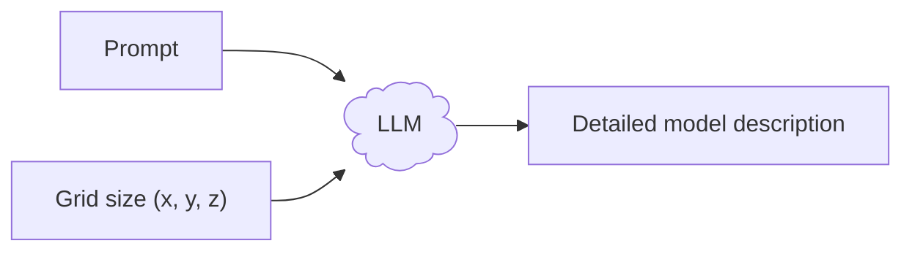
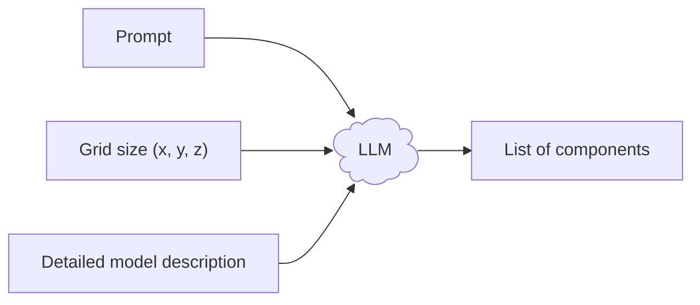
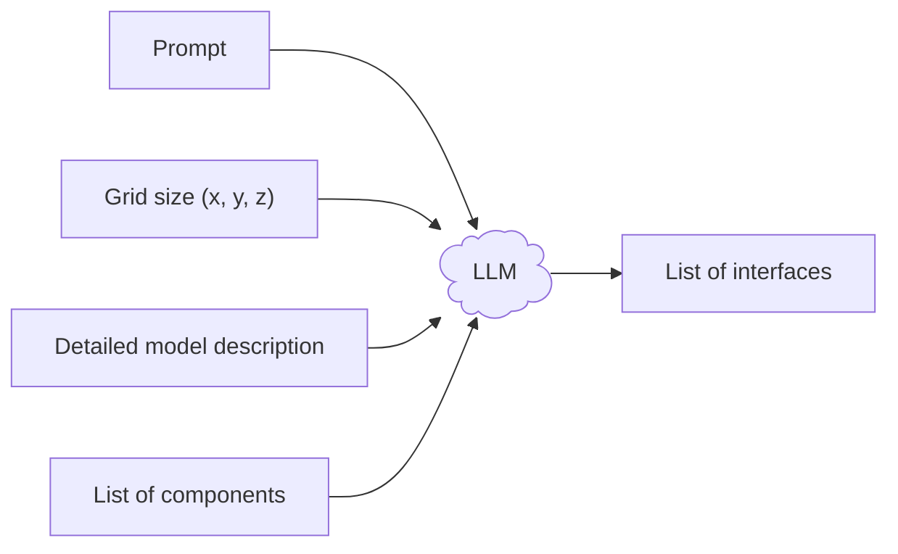
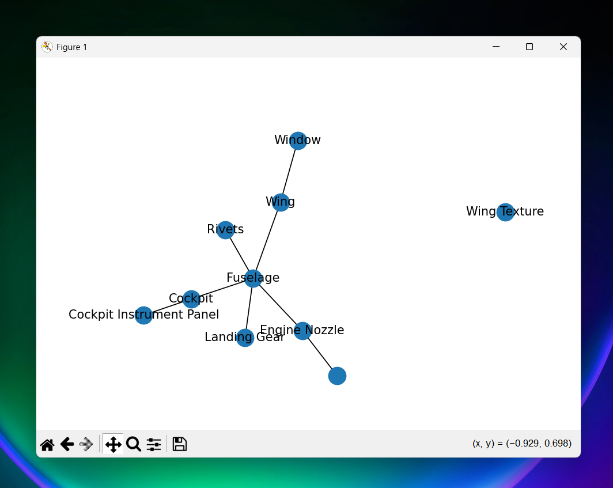
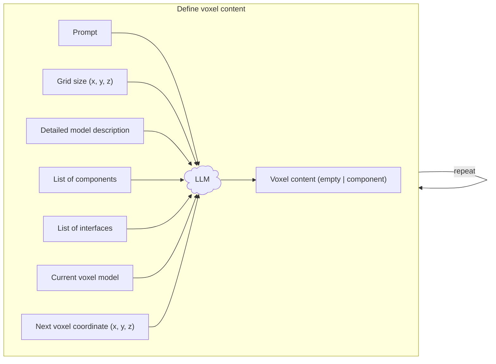
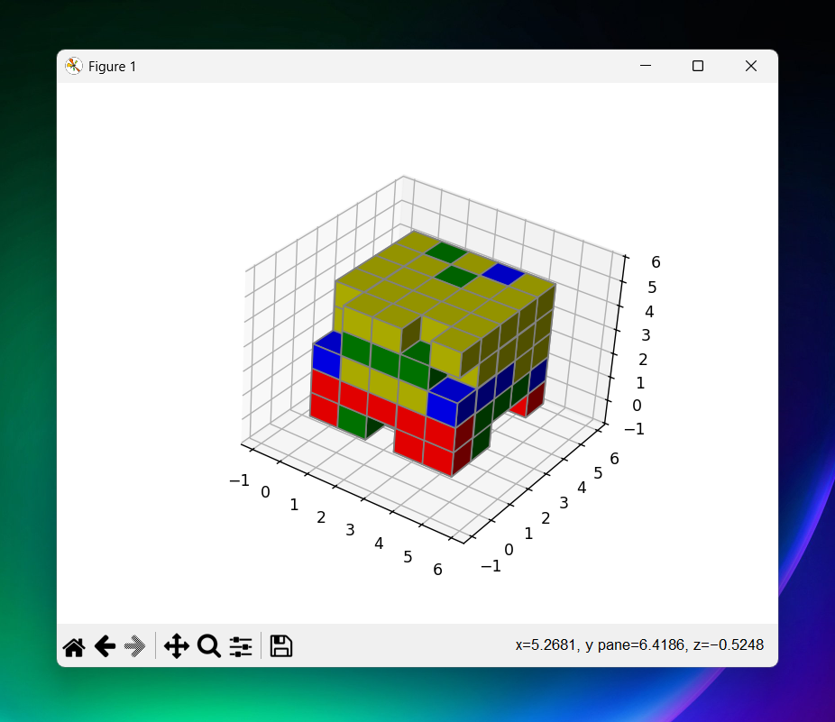

# **AgentBrick** - From Chat to CAD


**AgentBrick** is an open-source framework designed to bridge the gap between natural language and the **LDraw** standard. By leveraging **LangChain agents** and **LangGraph workflows**, AgentBrick transforms user prompts into valid, structured LDraw models, allowing for iterative refinement through conversational AI.

## User guide

```python
from agentbrick.workflows import main_workflow

main_workflow.invoke({
  "prompt": "[Intial model description]",
  "size_x": 5, "size_y": 5, "size_z": 5
})
```

## Main workflow

### Step 1: Model Description

Based on the initial user input (including the size of the discrete voxel grid), the agent derives a detailed description of the target model.



### Step 2: Component Graph

Then, the agent extracts a list of logical components (i.e. groups of connected voxels) and their interfaces with other components (i.e. voxels).

**Step 2.1: Extract components**



**Step 2.2: Extract interfaces**



**Step 2.3: Visualize components and interfaces**



### Step 3: Voxel Model

Finally, the agent iterates over the individual voxels of the voxel grid and determines the contents of each voxel (i.e. empty or assigned to component).

**Step 3.1: Define voxel model**



**Step 3.2: Visualize voxel model**



## Project structure

- [assets/](./assets/) - Project assets (icon, logo, social preview image, ...)
- [sources/](./sources/) - Source code
  - [agentbrick/](./sources/agentbrick/) - AgentBrick library
    - [agents/](./sources/agentbrick/agents/) - Agent package
      - [middlewares.py](./sources/agentbrick/agents/middlewares.py) - Middleware definitions (e.g. `log_model_call`)
      - [responses.py](./sources/agentbrick/agents/responses.py) - Response definitions (i.e. pydantic schema classes)
      - [tools.py](./sources/agentbrick/agents/tools.py) - Tool definitions (e.g. `calculate_sum`)
      - [\_\_init__.py](./sources/agentbrick/agents/__init__.py) - Agent definitions (e.g. `generate_description_agent`)
    - [workflows/](./sources/agentbrick/workflows/) - Workflow package
      - [states.py](./sources/agentbrick/workflows/states.py) - State definitions
      - [\_\_init__.py](./sources/agentbrick/workflows/__init__.py) - Workflow definitions
    - [models.py](./sources/agentbrick/models.py) - Model definitions (e.g. llama 3.2)
  - [main.py](./sources/main.py) - Main program
- [requirements.txt](./requirements.txt) - Project dependencies

## Developer guide

Install dependencies

```sh
pip install -r requirements.txt
```

Linting

```sh
black .
```

Static type checking

```sh
pyright
```